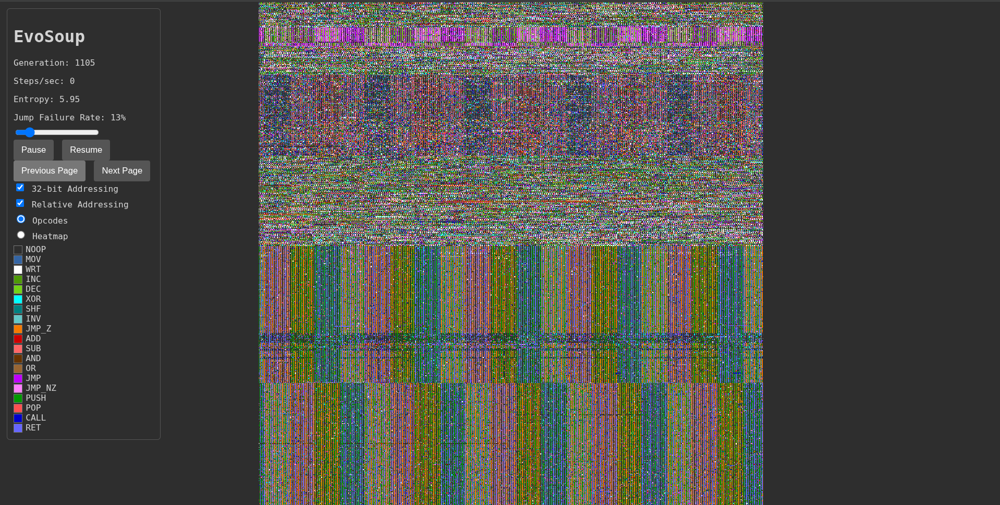

# EvoSoup

EvoSoup is an experiment in digital evolution that attempts to simulate life at its most fundamental level. It creates a virtual world where the very definition of an "organism" is not predetermined, but must emerge from the underlying physics of the simulation.



## The Concept

The core of EvoSoup is a shared memory space called the "soup," initialized with random instructions. A multitude of "Instruction Pointers" (IPs) concurrently execute this code. The IPs are not organisms; they are simply the focus of execution.

### Emergent Organisms and Competition

In EvoSoup, an "organism" is an emergent pattern of code that persists and propagates. There are no predefined boundaries for an organism, unlike in many artificial life projects. Survival depends on a pattern's ability to "capture" the limited supply of IPs. A pattern that can control an IP's flow (e.g., through loops or jumps) has effectively captured it.

This dynamic creates competition for CPU time, which is the only true resource. Multiple IPs run in parallel without thread safety, resulting in a chaotic race for execution. More complex behaviors can emerge, such as patterns that capture multiple IPs, copy themselves elsewhere in the soup, and release the new IPs to run the copies, achieving true replication. A pattern's fitness is simply a measure of its ability to be executed and re-executed.

### Comparison to Cellular Automata

EvoSoup shares similarities with Cellular Automata (CAs) like Conway's Game of Life, as both systems feature emergent complexity from simple, local rules. However, a crucial difference lies in their update mechanism. In a traditional CA, the entire grid of cells is updated synchronously in discrete time steps. Every cell's next state is calculated based on its neighbors, and then the entire system transitions to the next generation at once.

EvoSoup, by contrast, is updated asynchronously. The Instruction Pointers (IPs) run in parallel, and each one modifies the soup according to the instruction it is currently executing. This creates a dynamic where different code patterns are not updated in lock-step but are actively competing for execution cycles. This asynchronicity allows for a more fluid and competitive environment where patterns can gain an advantage by manipulating IP flow, rather than being bound to a global clock.

### Video Explainer

Watch a video explanation of EvoSoup here: https://youtu.be/KN-FWq_c2c4

## How to Run

1.  **Install Go:** Make sure you have Go installed on your system.
2.  **Run the simulation:** Open a terminal in the project directory and run the following command:

    ```bash
    go run .
    ```

3.  **View the simulation:** Open your web browser and go to `http://localhost:8080`. You will see a real-time visualization of the soup and the IPs. You can also interact with the simulation through the controls on the web page.

### Command-line Options

*   `-load <filename>`: Load a previous simulation state from a snapshot file.
*   `-duration <minutes>`: Run the simulation for a specific number of minutes. If not specified, the simulation will run indefinitely.

## The Frontend

EvoSoup includes a web-based frontend that allows you to visualize and interact with the simulation in real-time. The frontend is served automatically when you run the simulation and can be accessed at `http://localhost:8080`.

The frontend provides:

*   A real-time visualization of the soup's memory.
*   Statistics about the simulation, such as population size and instruction entropy.
*   Controls to pause, resume, and step the simulation.
*   Options to adjust simulation parameters, such as the jump rate and addressing modes.
